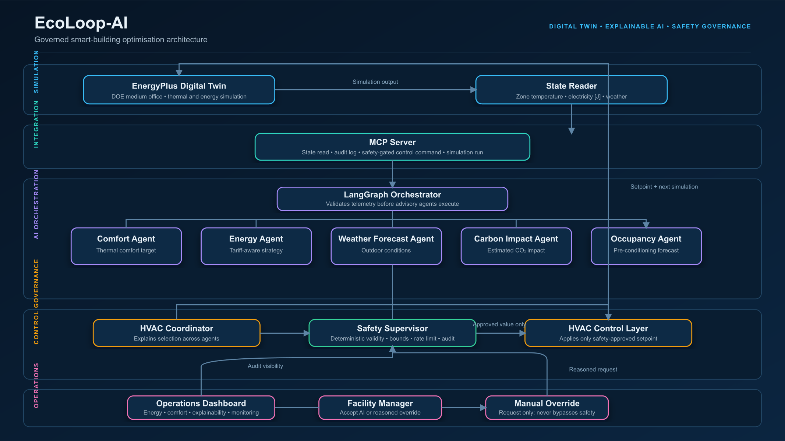

# EcoLoop-AI

EcoLoop-AI is a governed smart-building optimisation demonstrator. It combines an EnergyPlus digital twin, MCP tool layer, LangGraph multi-agent workflow, deterministic safety supervision, and an enterprise operations dashboard.

The design principle is simple: AI recommends; deterministic controls authorise; facility managers remain accountable.



## What the demo shows

- EnergyPlus simulation of a DOE Medium Office building.
- Specialist AI perspectives for comfort, energy, weather, carbon impact, and occupancy.
- Demand-response behaviour using simulated peak, normal, and off-peak tariffs.
- Schedule-based occupancy forecasting for pre-conditioning.
- Explainable coordinator decisions with agent agreement confidence.
- A deterministic Safety Supervisor between AI coordination and HVAC control.
- Facility-manager acceptance or override requests with an audit reason.
- A Streamlit operations dashboard with engineering units and system monitoring.

## Governed control flow

```text
EnergyPlus Digital Twin → State Reader → MCP Server → LangGraph
    → Comfort / Energy / Weather Forecast / Carbon Impact / Occupancy Agents
    → HVAC Coordinator → Safety Supervisor → HVAC Control Layer → EnergyPlus
```

The Safety Supervisor is not an LLM. It blocks invalid sensor data, rejects physically implausible setpoints, enforces the 21.0–24.0 °C operating range, limits setpoint movement to 1.0 °C per cycle, and records every approval, block, and adjustment.

## Quick start

```powershell
python -m venv .venv
.venv\Scripts\activate
pip install -r requirements.txt
ollama pull qwen2.5:3b

# Configure the EnergyPlus installation path in sim_runner/eplus_interface.py.
python sim_runner/run_baseline.py
python agents/graph.py
python sim_runner/compute_savings.py
streamlit run dashboard/app.py
```

The dashboard's Facility Manager panel can also submit a single governed cycle. It never calls the HVAC schedule writer directly.

## Engineering metrics

| Metric | Method |
|---|---|
| Energy reduction | `(baseline EnergyPlus electricity − AI EnergyPlus electricity) / baseline`; source units are joules and displays convert to kWh. |
| Comfort score | Percentage of reported zone mean-air-temperature values within the 21.0–24.0 °C demonstration target. This is not an ASHRAE 55 compliance claim. |
| Carbon impact | Energy delta in kWh × 0.386 kg CO₂/kWh demonstration factor. |
| AI confidence | Agreement derived from the standard deviation of specialist setpoint recommendations. |
| Safety checks | Count of auditable Safety Supervisor approvals and control blocks. |

## Project layout

```text
agents/
  graph.py                Governed LangGraph workflow
  safety_supervisor.py    Deterministic control interlocks
  operations.py           Tariff and occupancy demonstration models
  audit.py                SQLite explainability and override audit trail
dashboard/app.py          Enterprise Streamlit operations dashboard
mcp_server/               MCP tool contracts and implementations
sim_runner/               EnergyPlus bridge and savings calculations
docs/                      Architecture, production readiness, demo package
```

## Documentation

- [Architecture](docs/ARCHITECTURE.md)
- [Production readiness](docs/PRODUCTION_READINESS.md)
## Video Working
[https://drive.google.com/file/d/1HgXlrjLc-05SrBuYZmCVX-r6-0lEjxqt/view?usp=sharing](https://drive.google.com/file/d/14ohZaYZHDXAauPXYkY36IdXxD4hvujjI/view)


## Scope and safety statement

EcoLoop-AI is a simulation demonstrator. It is not a production BMS and does not claim BACnet, Modbus, ASHRAE 55, cybersecurity, or regulatory compliance. Any deployment to physical equipment requires site-specific engineering, commissioning, controls integration, cybersecurity review, and approved operational procedures.
